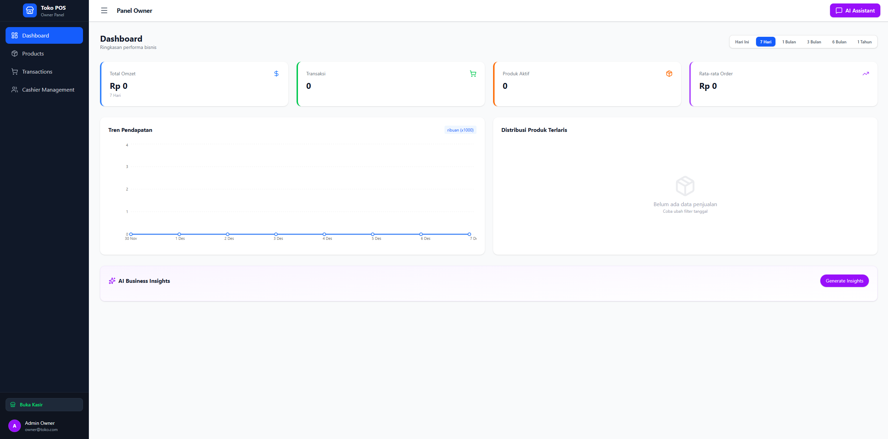
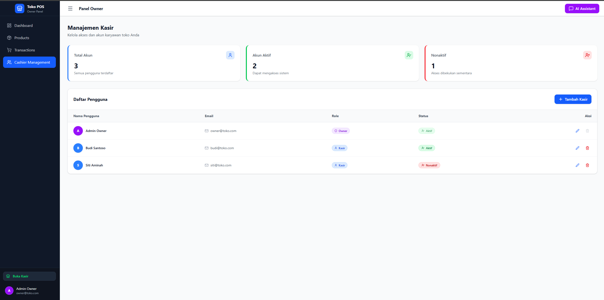
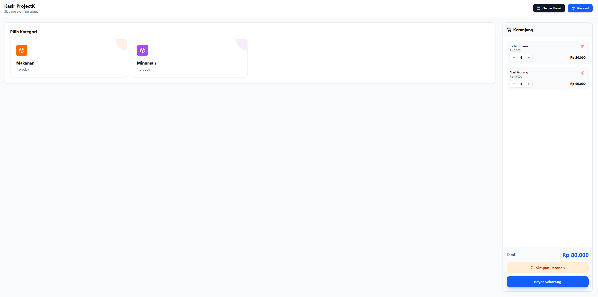
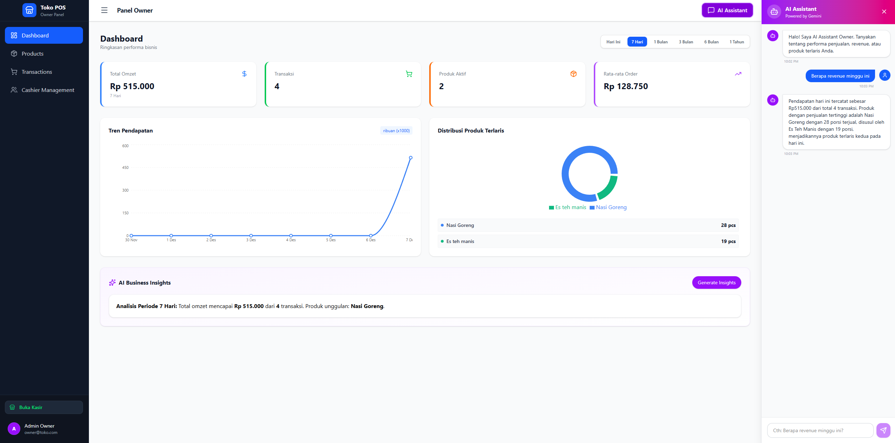

# 🧾 PROJECT K — UMKM Management System

Platform manajemen UMKM dengan dua role utama (**Owner** & **Cashier**) dilengkapi fitur **AI Insight & Chatbot**.  
Project terdiri dari dua bagian: **Frontend (Next.js)** dan **Backend (API Service)** yang terintegrasi penuh.

---

## 🚀 Live Demo

### **Frontend (FE)**

🔗 https://projectk-web.vercel.app/

### **Backend (BE – Swagger API Documentation)**

🔗 https://projectkapi-fpapgxfqbjenh7a2.indonesiacentral-01.azurewebsites.net/swagger

---

## 📂 Project Structure

- root/
  ├─ fe/ → Frontend (Next.js)
  └─ be/ → Backend (API)

---

## ✨ Features

### 👤 Role System

#### **Owner**

- Melihat omzet & total transaksi
- CRUD Product
- CRUD Cashier
- Melihat semua transaksi
- Mengakses dashboard analytics

#### **Cashier**

- Membuat produk (add to cart)
- Membuat transaksi
- Riwayat transaksi

---

## 🤖 AI Features

- **AI Chatbot** berbasis Gemini API
- **Insight Generator** untuk:
  - Total revenue
  - Best-selling product
  - Tren penjualan per periode

---

## 🧪 How to Test the Web App

### **Option 1 — Test via Live Website**

🔗 https://projectk-web.vercel.app/

---

### **Option 2 — Run on Local Device**

### **Required Installations**

- Visual Studio
- .NET 9 SDK
- .NET 9 Runtime (via Visual Studio)
- Visual Studio Code
- Node.js
- PostgreSQL 18

---

### **Procedure**

1. Clone [ProjectK.API](https://github.com/itsdomibro/ProjectK.API.git) repository
2. Open `ProjectK.API.sln` in Visual Studio
3. Open **Package Manager Console** and run: **Update Database**
4. Run `Program.cs` (Start the backend)
5. Open folder `projectk-web`
6. Run frontend: **npm run dev**

---

## 🖥️ Frontend (FE) — Local Setup

### **Install Dependencies**

1. Clone [ProjectK.Web](https://github.com/itsdomibro/projectk-web.git) repository
2. npm install

### **Environment Setup**

Create `.env.local`:
NEXT_PUBLIC_API_URL =< backend-url >

Runs at: http://localhost:3000

---
